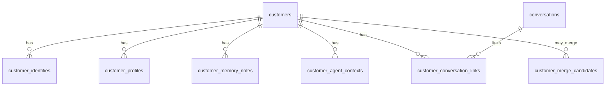

# 共通顧客マスター — DB 設計

schema: **`veriora`**（migration 065–067）

## ER（概要）

## テーブル一覧

| テーブル | 用途 |
|----------|------|
| `customers` | 横断顧客マスター |
| `customer_identities` | provider + channel_key + external_user_id |
| `customer_profiles` | 構造化プロフィール（好み・呼び名等） |
| `customer_memory_notes` | 長期メモ |
| `customer_agent_contexts` | 部署別要約 |
| `customer_conversation_links` | 会話 UUID の紐づけ |
| `customer_merge_candidates` | 同一人物候補（手動承認） |

`veriora.conversations.customer_id` は **NULL 許容の追加列**（link テーブルと併用）。

## RLS

062 以降と同様、`veriora` 新表は **RLS 有効・ポリシーなし**（service_role / `DATABASE_URL` 経由のアプリのみ）。

## 削除

- 論理削除: `customers.status = 'deleted'`
- merge 後: 統合元は `status = 'merged'`

物理 DELETE は運用手順でのみ（アプリ自動では行わない）。
